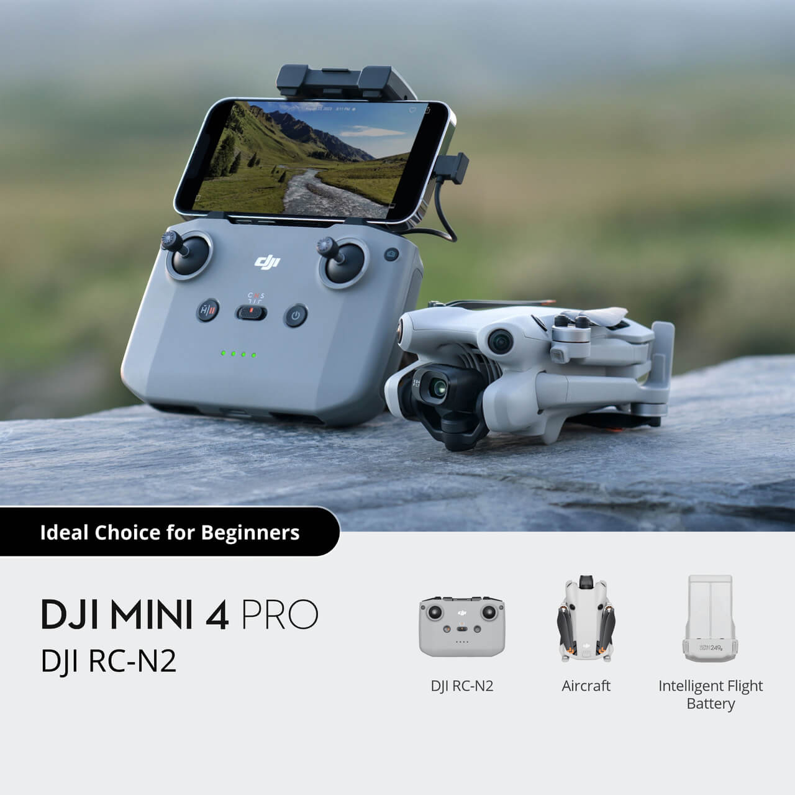
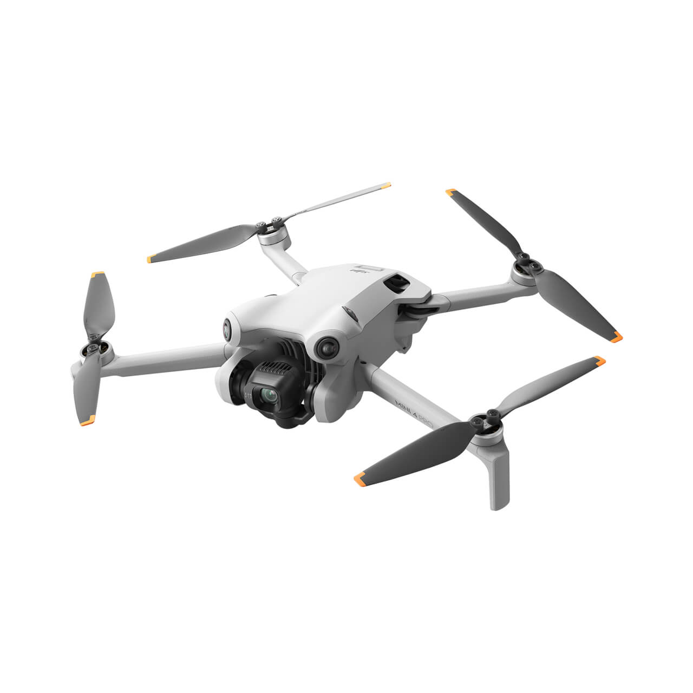
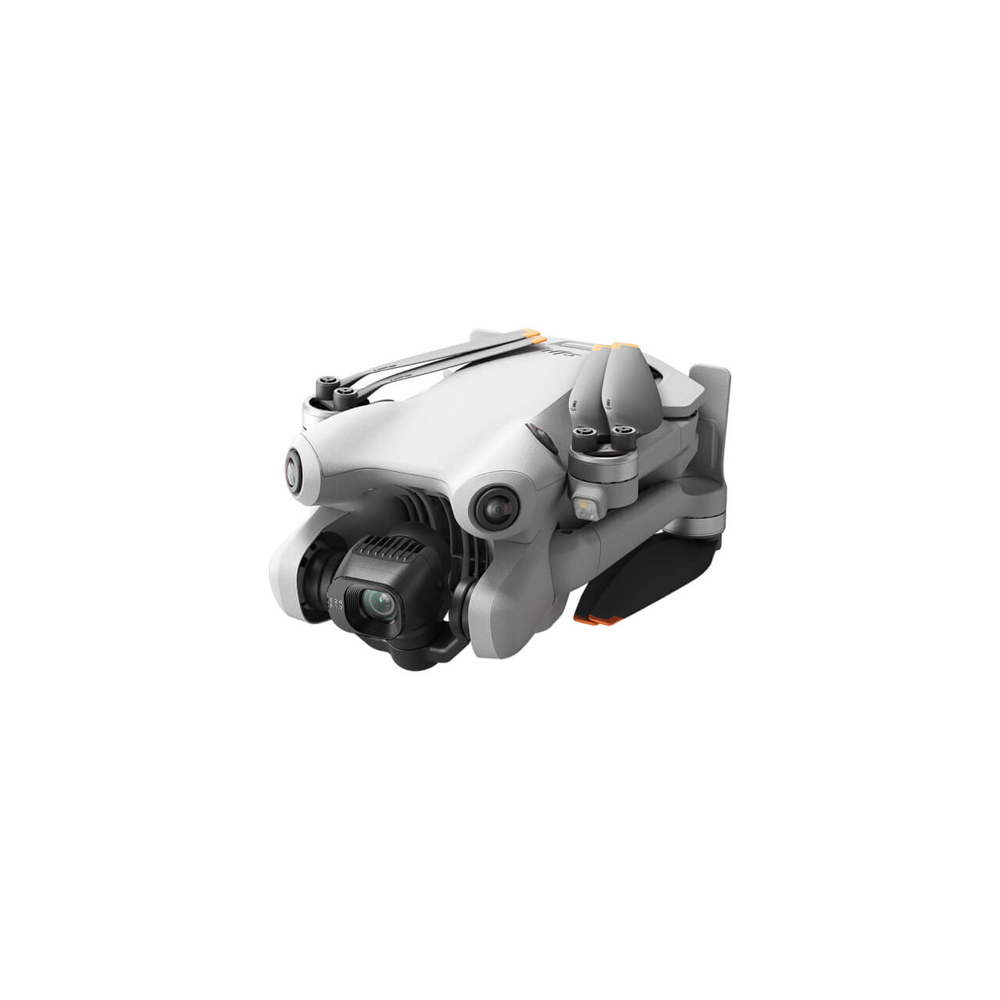
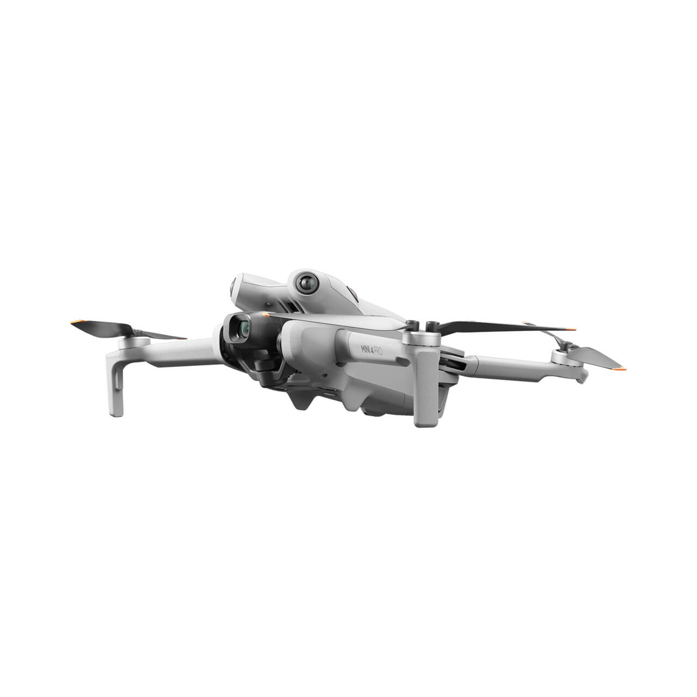
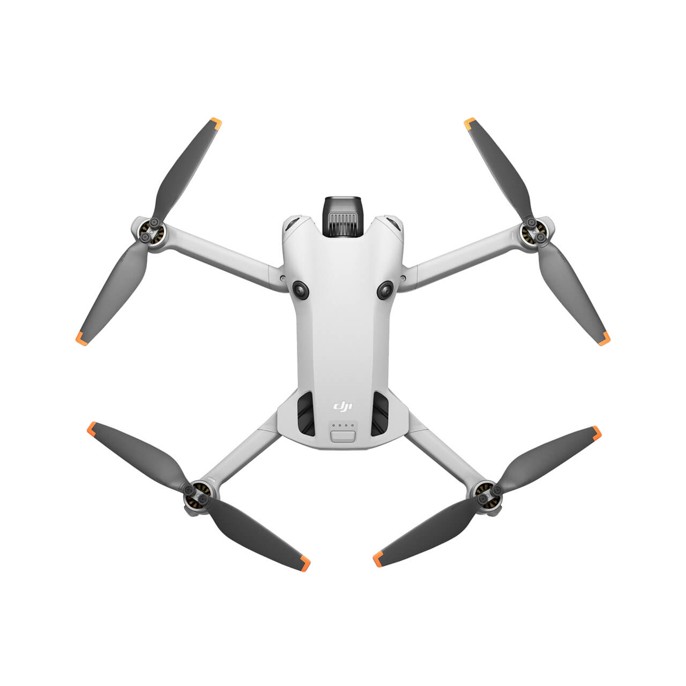
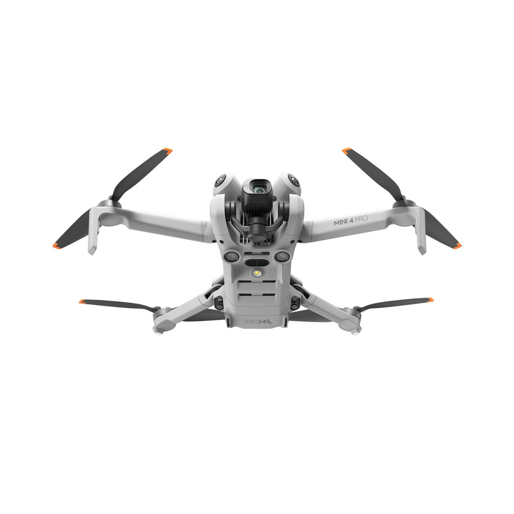
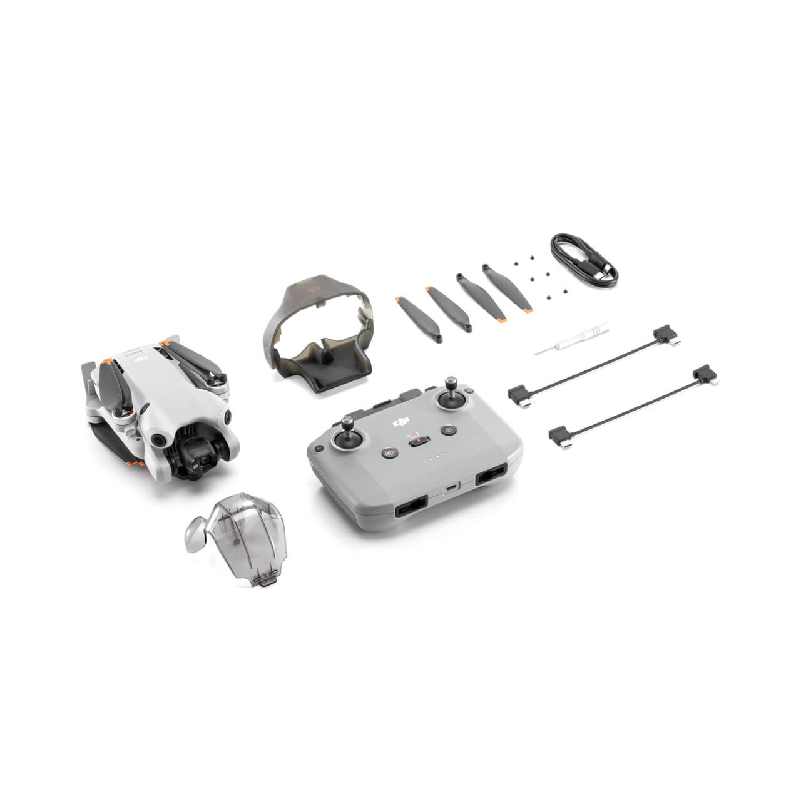

# 📅 [Phase 2] 지능형 드론 관제 파이프라인 프로젝트 상세 일정표

## 프로젝트 기간: 2026.07.13 ~ 2026.07.30 (약 3주간)

| 날짜 | 요일 | 주요 작업 목표 (Milestone) | 상세 진행 내역 및 태스크 | 비고 |
| :--- | :--- | :--- | :--- | :--- |
| **07.13** | 월 | **프로젝트 기획 및 아키텍처 설계** | - 2차 프로젝트 요구사항 분석 및 목표 수립 - 프로젝트 README.md 초안 작성 및 다이어그램 설계 | **[완료]** |
| **07.14** | 화 | **백엔드 초기 세팅 및 파이프라인 구축** | - Spring Boot 기반 백엔드 Controller 코드 구현 - 드론 관제 시스템 데이터 파이프라인 구조화 | **[완료]** |
| **07.15** | 수 | **컨테이너 환경 구성 및 트러블슈팅** | - Docker 기반 백엔드 컨테이너화 작업 - 백엔드 컨테이너 연결 오류 해결 및 통신 테스트 | **[완료]** |
| **07.16** | 목 | **1차 주간 보고 및 AI 환경 세팅** | - **1차 주간 작업 진행 보고 발표 (PPT)** - FastAPI 기반 AI 추론 서버 초기 세팅 | 🎯 **주간 발표** |
| **07.17** | 금 | **Vision AI 모델 연동 (객체 탐지)** | - YOLOv11 모델 적용 및 드론 영상 연동 테스트 - 실시간 안전모/보호구 탐지 로직 구현 | **[진행 중]** |
| **07.18** | 토 | **주간 코드 리뷰 및 리팩토링** | - 1주 차 작성 코드 리팩토링 및 기술 부채 해결 | 주말 |
| **07.19** | 일 | **자료 조사 및 추가 학습** | - Pose Estimation (자세 추정) 적용을 위한 레퍼런스 분석 | 주말 |
| **07.20** | 월 | **Vision AI 모델 연동 (행동 추정)** | - 객체 Keypoint 추출 및 비정상 자세 추정 로직 구현 - GPU 자원 최적화 및 추론 속도 개선 | |
| **07.21** | 화 | **AI ↔ Backend 데이터 통신 연동** | - FastAPI에서 Spring Boot로 이벤트 알림(REST) 전송 구현 - JSON 데이터 포맷 및 파싱 로직 확립 | |
| **07.22** | 수 | **데이터베이스 설계 및 로깅 시스템** | - MySQL DB 스키마 최종 확정 (불변 로그 테이블 등) - 위반 이벤트 발생 시 DB 영속화 로직 구현 | |
| **07.23** | 목 | **2차 중간 점검 및 보안 로직 적용** | - Spring Security 및 JWT 토큰 기반 권한(RBAC) 제어 구현 - 현장 관리자 / 최고 관리자 권한 분리 | |
| **07.24** | 금 | **프론트엔드 대시보드 연동 테스트** | - 웹 대시보드(클라이언트)와 백엔드 API 연동 - 관제 화면에 실시간 탐지 결과 시각화 테스트 | |
| **07.25** | 토 | **DevOps 인프라 통합 (1)** | - 전 컴포넌트(FastAPI, Spring Boot, DB) 멀티 컨테이너화 - Docker Compose를 이용한 가상 네트워크 결합 | 주말 |
| **07.26** | 일 | **DevOps 인프라 통합 (2)** | - Nginx 리버스 프록시 적용 및 라우팅 설정 보완 | 주말 |
| **07.27** | 월 | **CI/CD 자동화 파이프라인 구축** | - GitHub Actions 기반 무중단 통합/배포 스크립트 작성 - 파이프라인 엔드투엔드(End-to-End) 테스트 | |
| **07.28** | 화 | **최종 통합 테스트 및 버그 픽스** | - 무선 환경(드론 ↔ 서버) 지연 시간(Latency) 체크 및 최적화 - 전체 시스템 통합 QA 및 크리티컬 버그 수정 | |
| **07.29** | 수 | **발표 준비 및 산출물 정리** | - 프로젝트 결과 보고서 및 최종 발표용 PPT 제작 - 시연 영상(GIF/MP4) 촬영 및 README.md 최종 업데이트 | |
| **07.30** | 목 | **최종 프로젝트 결과 발표** | - **2차 프로젝트 최종 시연 및 성과 발표** | 🏆 **최종 발표** |

  
## 🚁실제 운용할 드론 모델 : DJI mini4 pro (RC-N2 포함) 
 

<!-- 드론 이미지 삽입 (맨 하단) -->

 

<!-- 드론 이미지 삽입 (맨 하단) -->

 

<!-- 드론 이미지 삽입 (맨 하단) -->

 

<!-- 드론 이미지 삽입 (맨 하단) -->

 

<!-- 드론 이미지 삽입 (맨 하단) -->

 

<!-- 드론 이미지 삽입 (맨 하단) -->

 

<!-- 드론 이미지 삽입 (맨 하단) -->

 

