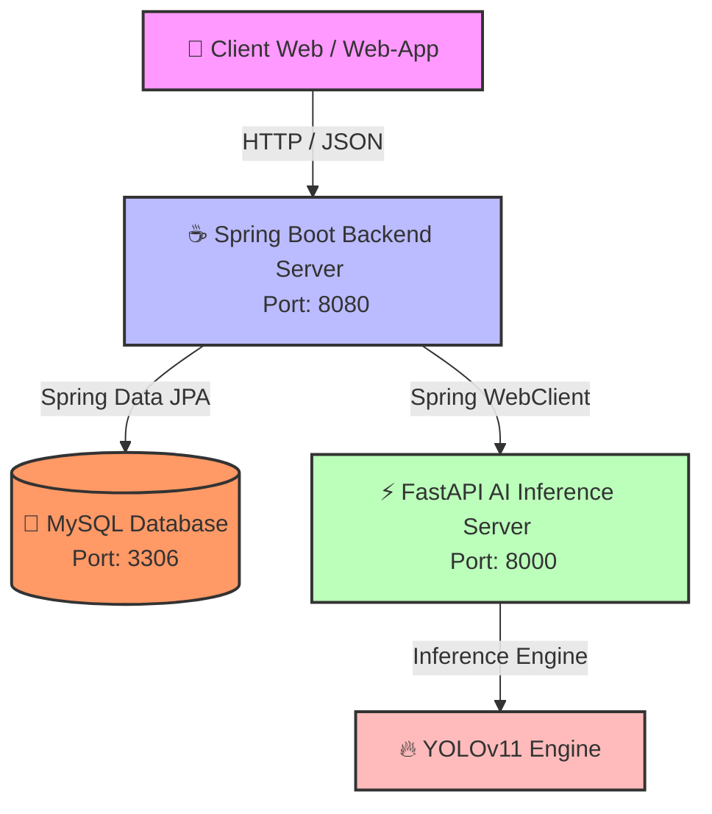

# 📦 VisionFlow
### AI 이미지 인식 기반 스마트 자산 관리 플랫폼
**Spring Boot의 견고한 백엔드와 Python의 고성능 AI 추론 엔진을 DevOps 파이프라인으로 관통하다.**

 

  사내 IT 자산 및 물류 재고를 AI 이미지 인식을 통해 자동화하고 통합 관리하는 고성능 비즈니스 하이브리드 솔루션입니다.

---

## 🛠 Tech Stacks

### 💻 Backend & Web
   

### 🤖 Artificial Intelligence
   

### 🗄 Database & DevOps
    

---

## 🚀 1. Project Architecture

VisionFlow는 자바 진영의 안정적인 트랜잭션 처리와 파이썬 진영의 고성능 AI 인프라를 분리 및 결합한 
**하이브리드 마이크로서비스 스타일(Base MSA) 아키텍처**를 지향합니다.

1) 역할의 명확한 분리 (Decoupling): Spring Boot는 비즈니스 로직, 회원 인가(JWT), DB 트랜잭션 제어에 집중하고, 
FastAPI는 경량화된 AI 모델 추론 및 이미지 전처리 인터페이스 역할만 전담하여 시스템 결합도를 최소화했습니다.

2) DevOps 친화적 구조: 각 컴포넌트는 완벽히 독립된 도커(Docker) 컨테이너로 격리되어 가상 네트워크 안에서 결합되며, 
향후 배포 파이프라인의 효율성을 극대화합니다.

 📂 2. Repository Structure

VisionFlow/
├── visionflow-backend/     # ☕ Java / Spring Boot 메인 백엔드 애플리케이션
├── visionflow-ai/          # ⚡ Python / FastAPI & YOLO 기반 AI 엔진 API 서버
├── visionflow-db/          # 🐬 MySQL DDL/DML 스크립트 및 ERD 문서화 관리
└── visionflow-devops/      # 🐳 Docker Compose, Nginx, CI/CD 워크플로우 설정 파트

 🎯 3. Key Features & Phase Roadmap
🏁 Phase 2: Core Service & AI Integration (7월 목표)
AI Automated Asset Logging

사용자가 물품 사진(노트북, 모니터, 키보드 등)을 업로드하면 AI가 객체를 식별하여 카테고리별로 자동 분류 및 재고 수량을 실시간으로 반영합니다.

Role-Based Access Control (RBAC)

Spring Security + JWT를 활용해 일반 직원(자산 조회 및 대여 요청)과 관리자(AI 기반 자산 등록 및 마스터 데이터 제어)의 권한 영역을 엄격히 차단합니다.

Asset History Tracking

모든 자산의 생성, 변경, 입출고 이력을 불변(Immutable) 로그 테이블로 격리하여 시스템 데이터의 정밀한 추적성을 보장합니다.

🚀 Phase 3: Infrastructure & DevOps Optimization (3차 목표)
Multi-Container Orchestration: 전 컴포넌트 컨테이너화(Docker) 및 가상 네트워크 결합(Docker Compose).

Automated CI/CD Pipeline: GitHub Actions를 활용한 무중단 통합 및 원격 배포 자동화.

Reverse Proxy & Security: Nginx를 최전방에 가동하여 실제 포트 숨김 처리 및 SSL(HTTPS) 안전 라우팅 적용.

👤 Developer 포지션
개발자: [이명휘] (PyvaOps 1인 팀 리더)

담당 역할: 기획 및 도메인 분석, 데이터베이스 모델링, 스프링 백엔드 아키텍처 구축, 
         파이썬 AI 인프라 파이프라인 설계, 데브옵스 CI/CD 자동화 운영 전과정 총괄

