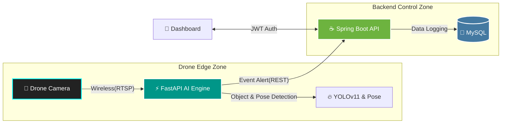
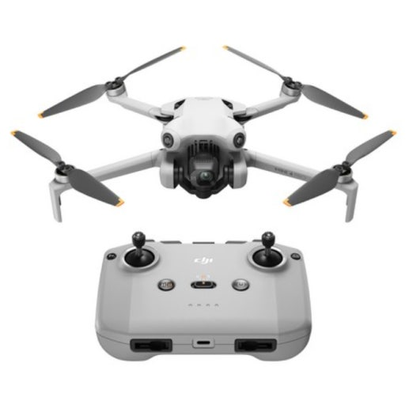

<div align="center">

<!-- 팀 로고 이미지 삽입 (맨 상단) -->


</div>
<br>
<div align="left">

<!-- 🎨 로고에 대한 간략하고 짜임새 있는 설명 추가 -->
<div align="center" style="max-width: 800px; text-align: left; background-color: #f6f8fa; padding: 15px; border-radius: 8px; border: 1px solid #ddd; margin-bottom: 20px;">
  <h3 style="margin-top: 0;">🎨 Team PyvaOps Logo Concept</h3>
  <p style="font-size: 0.95em; color: #333; line-height: 1.6;">
    팀명 <strong>PyvaOps</strong>의 정체성을 시각화한 이 로고는 서로 다른 기술 생태계를 하나의 완벽한 흐름으로 관통하는 <br><strong>'올라운더(All-rounder)'</strong> 개발팀의 핵심 가치를 담고 있습니다.
  </p>
  <ul style="font-size: 0.9em; color: #555; padding-left: 20px; margin-bottom: 0;">
    <li><strong>상징적 인피니티 루프:</strong> 단절 없는 통합과 지속적인 순환(CI/CD)을 의미하며, 세 가지 핵심 기술이 끊임없이 상호작용합니다.</li>
    <li><strong>기술별 아이콘 & 컬러 블렌딩:</strong> 좌측의 블루 Python(AI) 로고, 중앙의 오렌지 Java(Backend) 로고, 우측의 Teal DevOps(Infra) 심볼이 유기적으로 엮여 완벽한 시너지를 시각화합니다.</li>
    <li><strong>임팩트 있는 네온 에스테틱:</strong> 어두운 네트워크 배경 위의 강렬한 빛의 그라데이션은 AI 시대에 걸맞은 현대적이고 역동적인 기술력과 고성능 이미지를 전달합니다.</li>
  </ul>

</div>

---

<div align="center">

# 👁️ VisionFlow AI
## "지능형 드론 관제 및 무선 비전 AI 표준 파이프라인"

</div>

<br>

<div align="left">
  <h2><strong>Vision (AI 시각 지능) + Flow (실시간 데이터 흐름)</strong></h2>
  <p>VisionFlow AI는 작업 현장의 드론 영상 스트림(Vision)을 실시간으로 분석하고, 위반 상황과 관제 데이터를 지연 없이 백엔드로 흘려보내는(Flow) <br>고성능 하이브리드 안전 관제 솔루션입니다.</p>
</div>

<div align="left">
  <h2><strong>Developed by 팀 PyvaOps (1인 프로젝트)</strong></h2>
  <p><strong>Py</strong>thon (AI) + Ja<strong>va</strong> (Backend) + Dev<strong>Ops</strong> (Infra) :<br>
  서로 다른 기술 생태계를 하나의 파이프라인으로 관통하는 올라운더(All-rounder) 개발팀을 의미합니다.</p>
</div>

<br>

[](#)
[](#)

</div>

---

## 👀 Sneak Peek (시연 및 결과물)

> **💡 Note:** 현재 실시간 안전모 탐지 및 포즈 추정 시연 영상을 준비 중입니다.

<div align="center">
  
  <br>
  <sup><em>▲ 실시간 안전모 착용 여부 판별 및 추적 화면 (예정)</em></sup>
</div>

---

## 🛠 Tech Stacks

### 💻 Backend & Web
   

### 🤖 AI Vision Engine
   

### 🗄 Database & DevOps
    

---

## 🛰️ Architecture & Pipeline

드론에서 수집된 고해상도 영상을 무선 네트워크를 통해 실시간 처리하는 비즈니스 로직(Spring Boot)과 고연산 AI 추론(FastAPI)을 완벽히 분리한 **하이브리드 마이크로서비스 아키텍처**입니다. GPU 자원을 영상 분석에만 집중시켜 병목현상을 최소화합니다.

### 🌊 영상 처리 상세 흐름도 (Video Processing Flow)

<div align="center">
  
  <br>
  <sup><em>▲ 영상 처리에 관한 작업진행 화면 (예정)</em></sup>
</div>

### 🧩 System Architecture



<br>

---
## 🗺️ SkyGuard AI: 상세 데이터 파이프라인 다이어그램
🔍 다이어그램 상세 설명 : 
이 파이프라인은 크게 세 가지 영역으로 나뉘어 데이터가 흐릅니다.

### 1. 드론 엣지 영역 (Drone Edge Zone)

<li>센서 입력 (RTSP): 드론 카메라(Gimbal Camera)가 현장의 고해상도 영상을 실시간으로 획득합니다.</li>

<li>AI 추론 엔진 (FastAPI & YOLOv11): 획득한 영상 데이터는 온보드 또는 근거리 엣지 컴퓨터(NVIDIA Jetson 등)에서 실행되는 FastAPI 서버로 전달됩니다. 이 서버는 초경량화된 YOLOv11 모델을 구동하여 객체 탐지(Object Detection)와 자세 추정(Pose Estimation)을 실시간으로 수행합니다.</li>

### 2. 무선 전송 구간 (Wireless Data Flow)

<li>데이터 최적화: AI 엔진에서 분석된 결과는 전체 영상이 아닌, 탐지된 객체 정보(Bounding Box, Label, Confidence Score)와 핵심 키포인트 좌표만 JSON 형태로 압축됩니다. 이 경량화된 데이터는 무선 네트워크(LTE/5G)를 통해 클라우드로 안전하게 전송됩니다.</li>

### 3. 클라우드 관제 영역 (Cloud Backend Zone)

<li>백엔드 API 서버 (Spring Boot): 무선으로 수신된 이벤트 데이터를 Spring Boot API 서버가 받아 검증합니다.</li>

<li>데이터 영속화 (MySQL): 탐지된 이벤트 로그, 드론 상태 정보 등은 MySQL 데이터베이스에 안전하게 저장되어 이력 관리 및 분석에 활용됩니다.</li>

<li>관제 대시보드 (Web Client): 최종 사용자는 웹 브라우저를 통해 관제 대시보드에 접속하여, 실시간으로 드론의 위치와 AI가 탐지한 위험 상황을 시각적으로 모니터링할 수 있습니다.</li>

---


<div align="center">

<!-- 드론 이미지 삽입 (중간) -->


</div>


## 🎯 1. Core Features (핵심 기능)

<table>
  <thead>
    <tr>
      <th align="left">분류</th>
      <th align="left">기능</th>
      <th align="left">설명</th>
    </tr>
  </thead>
  <tbody>
    <tr>
      <td>🛡️ <br><b>안전탐지</b></td>
      <td><b>Drone-based Safety Gear Detection</b></td>
      <td>공중에서 작업자 식별 및 안전모/보호구 착용 여부 실시간 판별</td>
    </tr>
    <tr>
      <td>📍 <br><b>공간추적</b></td>
      <td><b>Real-time Object Tracking</b></td>
      <td>GPS 좌표와 결합한 객체 추적 및 이동 경로 모니터링</td>
    </tr>
    <tr>
      <td>🤖 <br><b>위험행동</b></td>
      <td><b>AI Human Pose Estimation</b></td>
      <td>쓰러짐, 급작스러운 움직임 등 드론 시점 기반 위험 행동 추정</td>
    </tr>
    <tr>
      <td>📝 <br><b>인프라</b></td>
      <td><b>Wireless Streaming Optimization</b></td>
      <td>무선 데이터 지연(Latency)을 고려한 경량화 비전 파이프라인</td>
    </tr>
  </tbody>
</table>

---

## 📂 2. Repository Structure
각 도메인은 완벽히 독립된 도커(Docker) 컨테이너로 격리되어 가상 네트워크 안에서 결합됩니다.

```text
VisionFlow_AI/
├── 01_AI_Inference_Server/ # ⚡ [Python] 실시간 영상 분석 및 이벤트 발행 엔진
├── 02_Backend_API/         # ☕ [Java] 통합 관제 대시보드 API 및 로직
├── 03_Frontend/            # 📱 [React] 메인 관제 화면 및 시각화 대시보드
├── 04_MySQL_db/            # 🐬 [SQL] 데이터베이스 스키마 및 ERD
└── 05_Infra_devops/        # 🐳 [Infra] Docker Compose, Nginx, CI/CD 설정
```

---

## 🎯 3. Key Features & Phase Roadmap


### 🏁 Phase 2: Core Safety Logic & AI Integration
현재 진행 중인 Phase 2에서는 드론을 통한 영상 수집과 AI 추론 엔진의 정밀도를 극대화하는 데 집중하고 있습니다.

Custom YOLOv11 Inference: 드론 환경(흔들림, 고도 변화)에 최적화된 학습 모델 적용.

Keypoint Extraction: 드론 시점에서의 사람 키포인트 추출 및 행동 분석 알고리즘 고도화.

RBAC & Integrity: 현장 상황에 즉각 대응하기 위한 권한별 관제 및 무결성 로그 기록.

### 🚀 Future Roadmap: Phase 3
Edge-Cloud Orchestration: 드론 현장 제어를 위한 Docker 기반 컨테이너 오케스트레이션.

DevOps Pipeline: GitHub Actions를 활용한 무중단 배포 및 자동화된 모델 업데이트.


Nginx Security: SSL/HTTPS 기반의 안전한 데이터 통신 환경 구축.

### 👤 Developer
개발자: 이명휘 (PyvaOps 1인 팀 리더)
주요 역할: 드론 AI 파이프라인 설계, 스프링 백엔드 고도화, 데브옵스 통합 운영 총괄.

본 프로젝트는 지능형 공공 안전을 위한 표준화된 비전 AI 파이프라인을 지향합니다.

---

## 🚀 4. 시작하기 (Quick Start)

Docker Desktop이 설치되어 있다면, 복잡한 환경 설정 없이 단 한 줄의 명령어로 전체 관제 시스템을 가동할 수 있습니다.

### 1. 프로젝트 클론 및 이동

git clone [https://github.com/automaster5013/VisionFlow_AI.git](https://github.com/automaster5013/VisionFlow_AI.git)

cd VisionFlow_AI


### 2. 전체 시스템 빌드 및 실행

최상위 디렉토리에서 아래 명령어를 실행합니다.

docker-compose up --build


### 3. 관제 시스템 접속

관제 대시보드 (React): http://localhost:5173 

AI 서버 API (FastAPI Docs): http://localhost:8000/docs 

백엔드 API (Spring Boot): http://localhost:8080/api/logs 

---

## 🎯 5. 개발 로드맵 (Roadmap)

[O] Phase 1: 시스템 초기 아키텍처 설계 및 데이터베이스 구축 (현재 완료)

[x] Phase 2: Custom YOLO 모델 학습 및 FastAPI 추론 서버 연동

[x] Phase 3: React 기반 실시간 관제 대시보드 및 통계 차트 구현

[x] Phase 4: Docker Compose를 활용한 전사적 시스템 패키징

[x] Phase 5: Telegram / KakaoTalk 메신저 기반 관리자 실시간 긴급 알림 봇 연동 (Next Step)

[x] Phase 6: Human Pose Estimation 기반 동적 위험 행동(쓰러짐 등) 감지 기능 추가

---

© 2026 Team PyvaOps. All rights reserved.