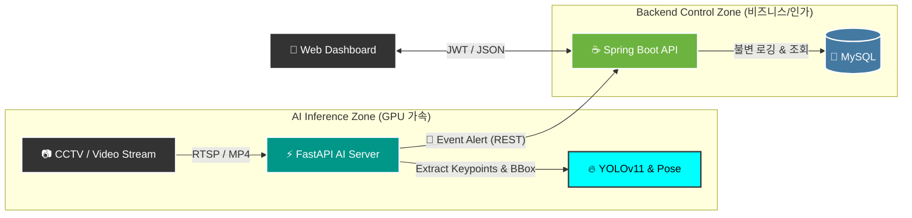

<div align="center">

<!-- 팀 로고 이미지 삽입 (맨 상단) -->


<br>

<!-- 🎨 로고에 대한 간략하고 짜임새 있는 설명 추가 -->
<div align="center" style="max-width: 800px; text-align: left; background-color: #f6f8fa; padding: 15px; border-radius: 8px; border: 1px solid #ddd; margin-bottom: 20px;">
  <h3 style="margin-top: 0;">🎨 Team PyvaOps Logo Concept</h3>
  <p style="font-size: 0.95em; color: #333; line-height: 1.6;">
    팀명 <strong>PyvaOps</strong>의 정체성을 시각화한 이 로고는 서로 다른 기술 생태계를 하나의 완벽한 흐름으로 관통하는 <strong>'올라운더(All-rounder)'</strong> 개발팀의 핵심 가치를 담고 있습니다.
  </p>
  <ul style="font-size: 0.9em; color: #555; padding-left: 20px; margin-bottom: 0;">
    <li><strong>상징적 인피니티 루프:</strong> 단절 없는 통합과 지속적인 순환(CI/CD)을 의미하며, 세 가지 핵심 기술이 끊임없이 상호작용함을 나타냅니다.</li>
    <li><strong>기술별 아이콘 & 컬러 블렌딩:</strong> 좌측의 블루 Python(AI) 로고, 중앙의 오렌지 Java(Backend) 로고, 우측의 Teal DevOps(Infra) 심볼이 유기적으로 엮여 완벽한 시너지를 시각화합니다.</li>
    <li><strong>임팩트 있는 네온 에스테틱:</strong> 어두운 네트워크 배경 위의 강렬한 빛의 그라데이션은 AI 시대에 걸맞은 현대적이고 역동적인 기술력과 고성능 이미지를 전달합니다.</li>
  </ul>
</div>

---

# 👁️ VisionFlow AI
**지능형 공공시설 및 작업장 안전 관제 시스템**

<br>

<div align="center">
  <sub><strong>Vision (AI 시각 지능) + Flow (실시간 데이터 흐름)</strong></sub>
  <p>CCTV 영상 스트림(Vision)을 실시간으로 분석하고, 위반 상황과 관제 데이터를 지연 없이 백엔드로 흘려보내는(Flow) <br>고성능 하이브리드 안전 관제 솔루션입니다.</p>
</div>

<div align="center">
  <sub><strong>Developed by 팀 PyvaOps (1인 프로젝트)</strong></sub>
  <p><strong>Py</strong>thon (AI) + Ja<strong>va</strong> (Backend) + Dev<strong>Ops</strong> (Infra) <br>
  서로 다른 기술 생태계를 하나의 파이프라인으로 관통하는 올라운더(All-rounder) 개발팀을 의미합니다.</p>
</div>

<br>

[](#)
[](#)

</div>

---

## 👀 Sneak Peek (시연 및 결과물)

> **💡 Note:** 현재 실시간 안전모 탐지 및 포즈 추정 시연 영상을 준비 중입니다.

<div align="center">
  
  <br>
  <sup><em>▲ 실시간 안전모 착용 여부 판별 및 추적 화면 (예정)</em></sup>
</div>

---

## 🛠 Tech Stacks

### 💻 Backend & Web
   

### 🤖 AI Vision Engine
   

### 🗄 Database & DevOps
    

---

## 🚀 1. Architecture & Video Processing Flow

비즈니스 로직(Spring Boot)과 고연산 AI 추론(FastAPI)을 완벽히 분리한 **하이브리드 마이크로서비스 아키텍처**입니다. GPU 자원을 영상 분석에만 집중시켜 병목현상을 최소화합니다.

### 🌊 영상 처리 상세 흐름도 (Video Processing Flow)

<div align="center">
  
  <br>
  <sup><em>▲ 영상 처리에 관한 작업진행 화면 (예정)</em></sup>
</div>

### 🧩 System Architecture


<br>

## 🎯 2. Core Features (핵심 기능)

<table>
  <thead>
    <tr>
      <th align="left">분류</th>
      <th align="left">기능</th>
      <th align="left">설명</th>
    </tr>
  </thead>
  <tbody>
    <tr>
      <td>🛡️ <br><b>안전탐지</b></td>
      <td><b>Real-time Safety Gear Detection</b></td>
      <td>관심 구역(ROI) 내 사람 및 이륜차를 식별하고, Custom 모델을 통해 <b>안전모/헬멧 착용 여부(With/Without)를 실시간 판별</b>합니다.</td>
    </tr>
    <tr>
      <td>🚶 <br><b>행동추정</b></td>
      <td><b>Human Pose Estimation</b></td>
      <td>영상 내 객체의 키포인트(Keypoint)를 추출하여 비정상적 자세나 쓰러짐 등 <b>동적 위험 행동을 즉각 인지</b>합니다.</td>
    </tr>
    <tr>
      <td>🔐 <br><b>권한제어</b></td>
      <td><b>Role-Based Access Control</b></td>
      <td>Spring Security와 JWT를 결합해 <b>현장 관리자(알림 수신)</b>와 <b>최고 관리자(마스터 제어)</b>의 관제 권한을 분리합니다.</td>
    </tr>
    <tr>
      <td>📝 <br><b>데이터 무결성</b></td>
      <td><b>Immutable Violation Logging</b></td>
      <td>탐지된 모든 위반 이벤트(스냅샷, 시간, 위치)를 <b>불변(Immutable) 로그 테이블</b>로 격리하여 감사(Audit) 기록을 보존합니다.</td>
    </tr>
  </tbody>
</table>

<br>

## 📂 3. Repository Structure
각 도메인은 완벽히 독립된 도커(Docker) 컨테이너로 격리되어 가상 네트워크 안에서 결합됩니다.

```text
VisionFlow_AI/
├── visionflow-backend/     # ☕ [Java] 통합 관제 대시보드 API 및 로직
├── visionflow-ai/          # ⚡ [Python] 실시간 영상 분석 및 이벤트 발행 엔진
├── visionflow-db/          # 🐬 [SQL] 데이터베이스 스키마 및 ERD
└── visionflow-devops/      # 🐳 [Infra] Docker Compose, Nginx, CI/CD 설정
```

<br>

## 🎯 4. Key Features & Phase Roadmap
🏁 Phase 2: Core Safety Logic & AI Integration (현재 진행 단계)
Real-time Safety Gear Detection (안전 장비 착용 탐지):
지정된 경계 구역(ROI) 내에서 사람(Person)과 자전거/이륜차 등의 객체를 식별하고, Custom 모델을 통해 헬멧 착용 여부(0: With Helmet, 1: Without Helmet)를 실시간으로 판별합니다.

Human Pose Estimation (동적 위험 행동 추정):
추론 결과에서 키포인트(Keypoint) 데이터를 추출하여, 작업자의 비정상적인 자세나 쓰러짐 등 위험 상황을 신속하게 인지합니다.

Role-Based Control Dashboard (RBAC 관제망):
Spring Security + JWT를 활용해 현장 관리자(경고 수신 및 현장 조치)와 최고 관리자(관제 구역 설정 및 마스터 데이터 제어)의 권한 영역을 엄격히 차단합니다.

Immutable Violation Logging (위반 이력 불변 로깅):
탐지된 모든 안전 위반 이벤트(스냅샷, 시간, 위치)를 불변(Immutable) 로그 테이블로 격리하여 안전 점검 및 감사(Audit)를 위한 데이터 무결성을 보장합니다.

<br>

## 🚀 Phase 3: Infrastructure & DevOps Optimization (다음 목표)
Multi-Container Orchestration: 전 컴포넌트 컨테이너화(Docker) 및 가상 네트워크 결합(Docker Compose).

Automated CI/CD Pipeline: GitHub Actions를 활용한 무중단 통합 및 원격 배포 자동화.

Reverse Proxy & Security: Nginx를 최전방에 가동하여 실제 포트 숨김 처리 및 SSL(HTTPS) 안전 라우팅 적용.

<br>

## 👤 Developer 포지션
개발자: 이명휘 (PyvaOps 1인 팀 리더)

담당 역할: 기획 및 도메인 분석, 데이터베이스 모델링, 스프링 백엔드 관제 시스템 구축, 파이썬 기반 객체/포즈 추론 AI 파이프라인 설계, 데브옵스 CI/CD 자동화 운영 전과정 총괄